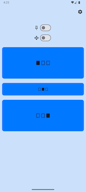
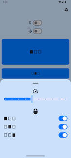
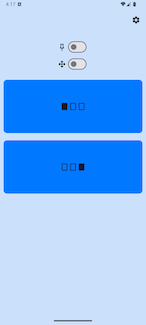
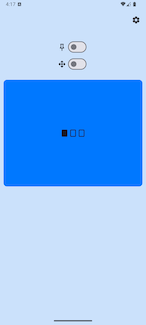
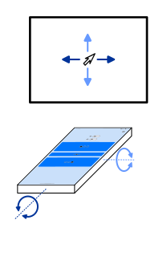
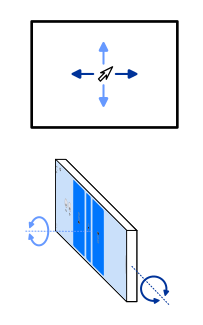
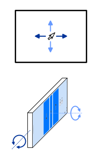

# MobileTiltMouse

An Android application that lets you control your computer's mouse using its corresponding [server application](../server).

## Features

- Kotlin
- Jetpack Compose
- Android Studio
- Minimum SDK: API 29 (Android 10)
- QUIC transport protocol of [Kwik library](https://github.com/ptrd/kwik) 
- Check of self-signed server certificate
- Successfully tested on API 29 hardware/phone and API 35 emulator (API 29 emulator fails: Network service cannot discovered)

## Screenshots of User Interface

 
 
 
 

## Phone Positions

The illustrations below show the three positions in which you can hold your phone. 

 
 

## Getting Started

1. Start the server on your computer
2. Build and run the app on your phone. The app will automatically connect to the server.
3. Use your phone's motion to control the mouse cursor.

## Acknowledgements

This project uses the following libraries:

- [Kwik](https://github.com/ptrd/kwik) – QUIC protocol
- [Mockito-Kotlin](https://github.com/mockito/mockito-kotlin) - mock for testing

