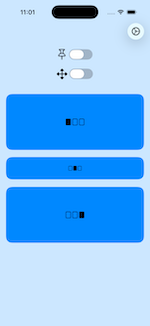
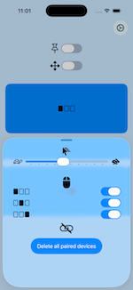
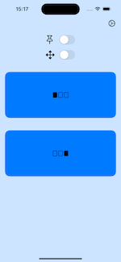
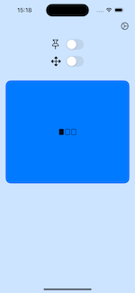
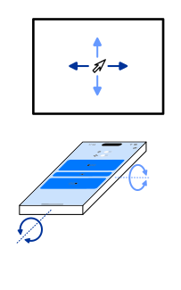
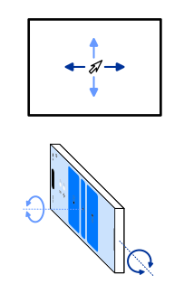
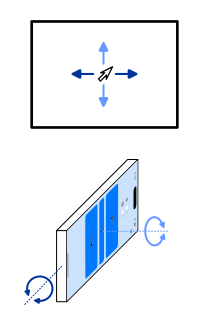

# MobileTiltMouse

An iOS application that lets you control your computer's mouse using its corresponding [server application](../server).

## Features
- Swift, SwiftUI, Xcode
- Minimum deployment: iOS 18
- QUIC transport protocol of Apple's network framework
- Checks self-signed server certificate
- Provides self-signed client certificate
- Device pairing, device IDs stored encrypted

## Screenshots of User Interface

 

 
 

## Phone Positions

The illustrations below show the three basic positions in which you can hold your phone. 

 
 

## Getting Started

1. Build and run the [server](../server) on your computer.
2. Build and run the app on your phone. 
3. The app will automatically connect to the server. On the very first connection, the pairing code of the server need to be entered.
4. Use your phone's motion to control the mouse cursor.

When you start the app for the first time on your phone, it will request permission to access the local network. Please confirm this permission.

## Client certificate

The creation of the self-signed client certificate of the QUIC connection is described in the [certificate section of the server](../server/README.md#self-signed-certificates).

It is important to build the server software before the app software is compiled. As all certificates are created during the build of the server.