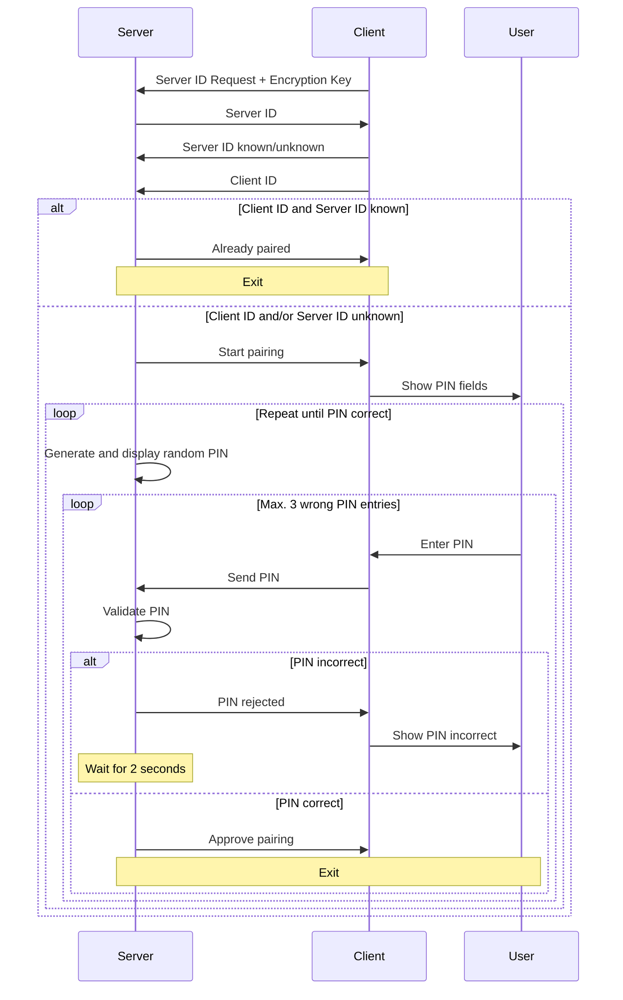

# Mobile Mouse

A server application that allows you to control your computer's mouse using a mobile device with an app for iOS [AppiOS](../AppiOS) or Android [AppAndroid](../AppAndroid).

Tested on MacOS, Linux (with X11) and Windows.

## Features

- Rust
- QUIC transport protocol of [quinn crate](https://crates.io/crates/quinn)
- Provides self-signed server certificate
- Checks self-signed client certificate
- Device pairing, device IDs stored encrypted
- Mouse pointer is bound to the monitor in which the server is started


## Installation

1. Prerequisites: \
   Dependencies to crates [enigo](https://github.com/enigo-rs/enigo) and [zeroconf](https://github.com/windy1/zeroconf-rs) require the installation of additional packages:
    - MacOS: None
    - Linux: \
      Use X11, not Wayland. Install:
      ```
      sudo apt update && sudo apt install libxdo-dev xorg-dev libxcb-shape0-dev libxcb-xfixes0-dev clang avahi-daemon libavahi-client-dev
      ```
    - Windows: \
      If you [install Visual Studio for using Rust](https://rust-lang.github.io/rustup/installation/windows-msvc.html), also select manually (both) `clang` components for installation.
      For Bonjour install iTunes or Bonjour Print Services or just:
      ```
      winget install Apple.Bonjour
      ```
      - Windows x64: \
        Set environment variable to a directory containing x64-version of `libclang.dll` (required by [bindgen](https://github.com/rust-lang/rust-bindgen)). For Visual Studio 2026 Community Edition it is:
        ```
        set LIBCLANG_PATH=C:\Program Files\Microsoft Visual Studio\18\Community\VC\Tools\Llvm\x64\bin
        ```
      - Windows Arm64: \
        Set environment variable to a directory containing Arm64-version of `libclang.dll` (required by [bindgen](https://github.com/rust-lang/rust-bindgen)). For Visual Studio 2026 Community Edition it is:
        ```
        set LIBCLANG_PATH=C:\Program Files\Microsoft Visual Studio\18\Community\VC\Tools\Llvm\ARM64\bin
        ```
        Prepare for cross compilation for Windows x64 (because of Bonjour):
        ```
        rustup target add x86_64-pc-windows-msvc
        ```
    

1. Clone the repository:
   ```
   git clone https://github.com/JoergDF/MobileTiltMouse.git
   cd MobileTiltMouse/server
   ```

1. Build and run the application:
   - MacOS, Linux, Windows x64:
     ```
     cargo run
     ```
   - Windows Arm64: \
     Cross compilation for Windows x64 is required because of Bonjour package.
     ```
     cargo run --target x86_64-pc-windows-msvc
     ```

## Usage

1. Start the server in a terminal on the computer, on which you want to control the mouse.
2. Start one of the provided mobile apps. It will connect automatically to the server.
3. If client and server do not yet known each other, the server will ask for a pairing code, which must be entered on the client.
3. Control your computer's mouse remotely.
4. When finished, exit server with Ctrl-C.

On MacOS you need to allow the terminal to control your computer in order to move the mouse pointer.

You need to allow this server app to accept incoming connections in your computer's firewall.


## Protocol

The QUIC connection is configured as a bidirectional stream between client and server at the beginning. After pairing succeeded only the direction from client to server is continued. 

### Establishment of Connection

1. Server advertises itself via Bonjour as `_mobiletiltmouse._udp`. When client finds that name in the local network, it gets IP address and port number of the server.
2. Client and server establish a QUIC connection (ALPN: `mobiletiltmouseproto`) and verify each other's certificate.
3. Pairing between client and server is executed.
4. Unidirectional mouse control is enabled.

### Pairing



### Data Packets of Mouse Control

Each packet is 3 bytes with the following format:
- Byte 2: Header (4 bits) | Data (4 bits)
- Byte 1: Data
- Byte 0: Data

Data packets with unknown headers are ignored.

|                             | Header | | Payload |
|:-                           |-:|-:|-:|
|*bit position*               |*23...20*|*19...10*|*9...0*|
|move                         |0x0|$\Delta$ y|$\Delta$ x|
|scroll                       |0x1|$\Delta$ y|$\Delta$ x|
|left button press            |0x2||0|
|left button release          |0x2||1|
|middle button press          |0x2||2|
|middle button release        |0x2||3|
|right button press           |0x2||4|
|right button release         |0x2||5|


## Self-signed certificates

The QUIC connection uses different self-signed certificates for server and client. The certificates are created during build phase of the server software. Every time new certificates and their keys are created they are different. New versions are created after `cargo clean` or if the file `build.rs` is changed.

The server build process automatically includes server certificate and client certificate hash. Client certificate and server certificate hash are copied to [iOS app](../AppiOS) and [Android app](../AppAndroid). They are integrated when the apps are built. 

Therefore it is required to first build the server and then the clients.
  

## Certificate Check

The server's certificate is sent to the client on connection setup. And the server requests the client's certificate. The sha256-hash of both self-signed certificates are compared against their reference hashes. If a check fails, the connection is not established.


## Tests

- **Unit tests**  
  To run unit tests:
  ```
  cargo test
  ```

- **Integration tests**  
  Integration tests are available for both iOS and Android. These tests launch an iOS simulator or Android emulator on the same computer, where a test case of the apps (simulating a button press) interacts with the server. The server then verifies if the correct signal is received.

  ***Prerequisite:***  
  The appropriate development environment (Xcode for iOS, Android Studio for Android) must be installed on the test machine, which should run MacOS (not tested with Linux or Windows).

  ***Run:***  
  Integration tests are not run by default with other tests and must be explicitly invoked.  
  *Do not use mouse or keyboard during these tests,* as real mouse/keyboard events are evaluated.

  - To run both iOS and Android integration tests:
    ```
    cargo test --test integration_tests -- --ignored --test-threads=1
    ```

  - To run only the iOS integration test:
    ```
    cargo test --test integration_tests -- test_ios_receive_button_clicks --ignored
    ```

  - To run only the Android integration test:
    ```
    cargo test --test integration_tests -- test_android_receive_button_clicks --ignored
    ```


## Acknowledgements

This project uses the following libraries:

- [enigo](https://crates.io/crates/enigo) - mouse control
- [quinn](https://crates.io/crates/quinn) – QUIC protocol implementation
- [rustls](https://crates.io/crates/rustls) - TLS configuration
- [tokio](https://crates.io/crates/tokio) - connection handling
- [zeroconf](https://crates.io/crates/zeroconf) - Bonjour/mDNS service
- [hex](https://crates.io/crates/hex) - hex conversion in certificate handling 
- [sha2](https://crates.io/crates/sha2) - client certificate check with RustCrypto's hashes, creating PKCS#12 certificate
- [aes-gcm-siv](https://crates.io/crates/aes-gcm-siv) - encrypted storage of server and client IDs
- [hkdf](https://crates.io/crates/hkdf) - HMAC-based Key Derivation Function
- [rand](https://crates.io/crates/rand) - pairing code generation, creating PKCS#12 certificate 
- [rand_core](https://crates.io/crates/rand_core) - creating PKCS#12 certificate 
- [rand_pcg](https://crates.io/crates/rand_pcg) - creating PKCS#12 certificate
- [p12-keystore](https://crates.io/crates/p12-keystore) - handle PKCS#12 certificate
- [rcgen](https://crates.io/crates/rcgen) - creating server and client certificates
- [zeroize](https://crates.io/crates/zeroize) - securely clear key from memory
- [rdev](https://crates.io/crates/rdev) - listen to mouse events in integration tests

See `Cargo.toml` and `Cargo.lock` for a full list of dependencies.
